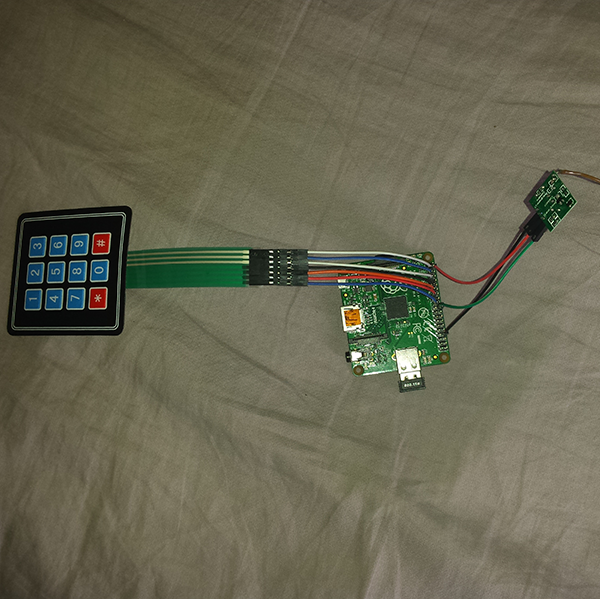
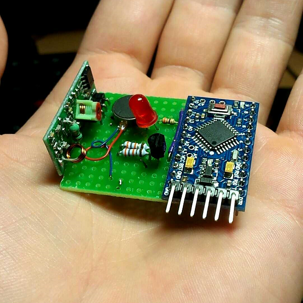

# Appel Client pour gestion de file d'attente

## But du projet

Ce projet à pour but de simplifier les files d'attente en permettant personnes de faire autre chose pendant leur attente. Pour ce faire, on confiera un "palet" au client, celui-ci vibrera et emettra un signal lumineux lorsque ce sera son tour.

## Origine du projet

J'ai commencé ce projet en mars 2016 lorsqu'un restaurateur me demande comment il pourrait gérer sa file d'attente intelligement et avec les moyens d'aujourd'hui.
Je me suis inspiré d'un produit déjà existant depuis quelques années qui arrive timidement en France, un système d'appel de Client nommé **MMCALL**.

Le problème est que ce produit n'est pas open-source et qu'il coûte relativement cher. C'est pourquoi j'ai proposé de réaliser moi-même une **alternative** qui proposerait les même fonctionnalités mais en êtant **open-source et en utilisant des composants à bas prix**.

## Spécifications techniques

### Matériel

Le système sera composé d'un emmeteur à base de Raspberry Pi et d'un nombre "illimité" de récepteurs à base d'Arduino.
La communication sans-fil entre les deux composants sera par RF en 433Mhz car on peut trouver des émetteurs/récepteurs à très bas prix.
Les récepteurs fonctionneront sur des batteries LiPo rechargeables. Pour le reste des composants une nomenclature est mise à disposition dans le dossier _Design_.

### Logiciel

Sur l'émetteur j'ai utilisé pigpio, une librairie Python pour utiliser les pins de la Raspberry Pi. et VirtualWire, en python elle aussi pour la transmission sans-fil.
le reste du programme est en python.

## Montage

### Emmeteur
L'émetteur est alimenté en 12V DC afin de fournir la tension maximale pour le module d'antenne puis cette tension est abaissée et régulée à 5V afin de fournir une alimentation à la carte Raspberry Pi. Cette carte est aussi équipée d'un clavier numérique et d'un dongle wifi pour un accès en SSH. (Un accès en série est également possible).

Premier prototype de l'emmeteur :

Ce prototype est pour l'instant le seul emmeteur réalisé, il est prévu de faire une version améliorée de celui-ci qui sera imprimée en 3D.

### Recepteur

Ce récepteur est composé d'un carte Arduino Pro Mini, d'un step-up pour batterie LiPo (qui fait aussi chargement USB), d'une batterie LiPo (2200mAh ici), et d'une carte qui gère la vibration, une LED pour un signal visuel et le module de réception 433Mhz. Le tout est mis dans une boite en bois (qui sert normalement à contenir un jeu de cartes).

Prototype de la carte de réception (ici sans module pour la batterie) :

Circuit final de la carte de réception (sans module de batterie):

Version finale du récepteur dans la boîte :
  
